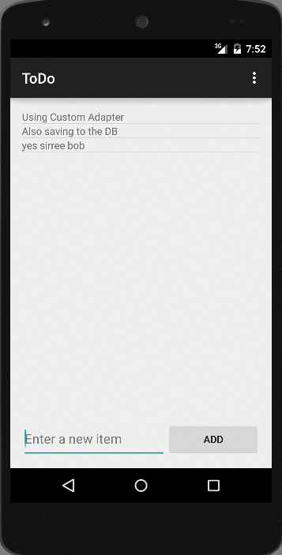

Android-SimpleToDo
==================

Prework for CodePath Android SimpleToDo

Time spent: 5 hours spent in total

Completed user stories:

* [x] Required: User can add and remove items from a list
* [x] Required: User can edit items in a list
* [x] Required: The list is persisted on file.
* [x] (Suggested) Persist the todo items into SQLite instead of a text file.
* [x] (Suggested) Used custom adapter to display TodoItem object data.

Notes:

Further iterations with suggested features.

Walkthrough of SQLite persistence using ActiveAndroid and CustomAdapters for display:

GIF created with [Recordit](http://recordit.co/) as LiceCap did not work on Yosemite.

