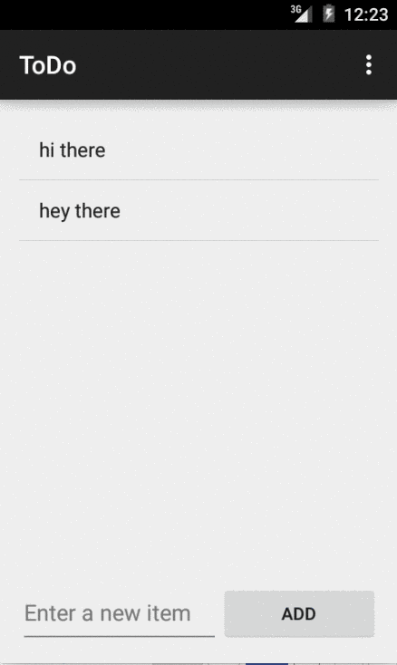
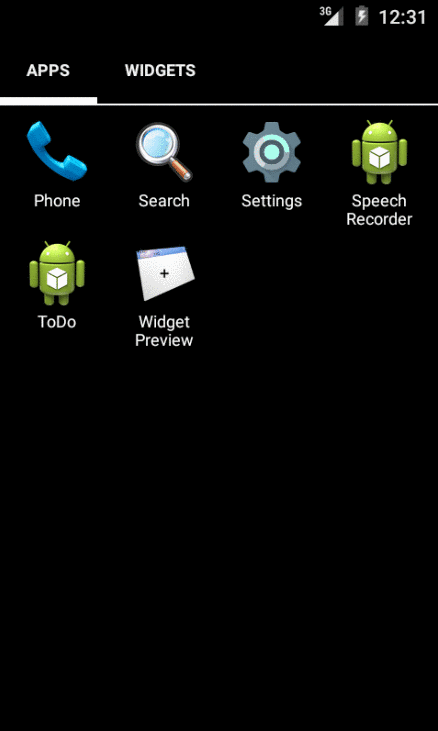

Android-SimpleToDo
==================

Prework for CodePath Android SimpleToDo

Time spent: 3 hours spent in total

Completed user stories:

* [x] Required: User can add and remove items from a list
* [x] Required: User can edit items in a list
* [x] Required: The list is persisted on file.

Notes:

This is the initial commit with the base requirements for getting accepted to the course.
Future iterations

Walkthrough of list add, remove, edit:

Walkthrough of list persistence:

GIF created with [Recordit](http://recordit.co/) as LiceCap did not work on Yosemite.

